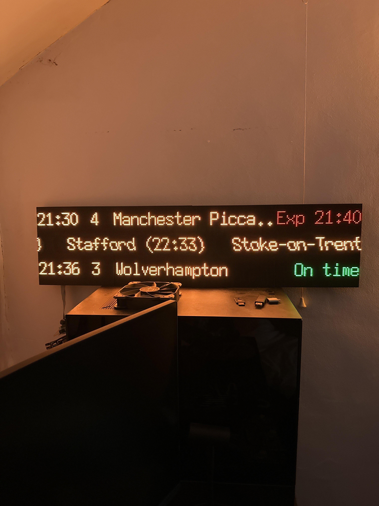

# LedMatrixDepartureBoard

This project aims to use HUB75 matrix displays in order to show live departure times in a uk platform display styling



## How to setup

### Hardware

As this project is designed specifically for HUB75 style matrix panels, you will need all the equipment required
in order to control them using a raspberry pi. Here are some examples of what is needed

- Raspberry Pi (Preferably Pi4 as this software is CPU intensive)
- HUB75 adapter - [Example from adafruit](https://thepihut.com/products/adafruit-rgb-matrix-bonnet-for-raspberry-pi-ada3211)
- HUB75 Matrix display (Only been tested with a chain of 64x64, so 64x32 might need some code changes) - [Example from thepihut](https://thepihut.com/products/rgb-full-colour-led-matrix-panel-3mm-pitch-64x64-pixels)
- Power supply to power the panels. Must be 5v, and roughly 4amps for each panel. [Example from amazon](https://www.amazon.co.uk/gp/product/B07PQT2Q7L/ref=ppx_yo_dt_b_search_asin_title?ie=UTF8&psc=1)

### Hardware Setup

I highly recommend following this guide on setting up your matrix panels, as this includes configuring the pi to work efficiently, 
as well as some easy to run demo examples to ensure everything is working

<https://learn.adafruit.com/adafruit-rgb-matrix-bonnet-for-raspberry-pi/>

### Software Setup

Once you have followed the above guide and got a demo working, you should be ready to setup the departure board software.

> The following commands should be run from the raspberry pi
1. Download the latest version of the project (This is a pre-release at the moment. Only works on Pi 4, can however be compiled to run on Pi 3)
```bash
wget https://github.com/benfl3713/LedMatrixDepartureBoard/releases/download/v0.1/departure-linux-arm64.zip
```

2. Extract the zip file to a folder
```bash
mkdir departureboard
unzip departure-linux-arm64.zip -d departureboard
```

3. Setup your board configuration file
```bash
cd departureboard
nano appsettings.json # Or your editor of choice
```
Use the arrow keys to navigate around and edit the "FullRows" and "FullRows" to match the total of your display. The example values are for 4 (64x64) panels in a line.
The settings within the Matrix section are specific to the project here: <https://github.com/hzeller/rpi-rgb-led-matrix/>

Once done you can save the file by pressing `Ctrl + X` followed by `Y` and finally `Enter`

4. Startup the software for the first time. Sudo access must be granted in order to control the display correctly.
```bash
sudo ./LedMatrixDepartureBoard
```